# 🧠 AI Infra Roadmap

**A free, open-source, opinionated path from "I can write Python" to "I run frontier-scale AI infrastructure."**

Real tools · Real math · Real projects · Every resource free

[The Map](#the-map) · [Pick Your Entry Point](#pick-your-entry-point) · [6 Stages](#the-roadmap-in-6-stages) · [The Stack](STACK.md) · [Projects](PROJECTS.md) · [Resources](RESOURCES.md)

---

## What this is

AI infrastructure is the discipline of making models **train faster, serve cheaper, and stay up** — GPUs, kernels, distributed training, inference engines, data pipelines, orchestration, retrieval, observability, and the cost math that ties them together.

It is one of the highest-leverage skills in software right now, and almost all of the knowledge is already floating around for free — scattered across arXiv papers, Discord servers, blog posts, half-abandoned awesome-lists, and 200k-star repos with no onboarding.

This repo fixes the *ordering* problem.

It gives you:

1. **A map** of the whole stack, so you know what you don't know.
2. **A 6-stage roadmap** with concrete exit criteria, so you always know your next step.
3. **A curated stack** of ~200 open-source projects with live star counts and licenses, so you pick the boring, correct tool.
4. **17 buildable projects** with acceptance criteria, because infra is learned with your hands.
5. **The math** — the back-of-envelope formulas that separate people who *configure* systems from people who *design* them.

> **What this is not:** a list of every AI repo on Earth. Curation means exclusion. If a tool is here, it earned its place for a learner or a practitioner. Star counts in tables are refreshed weekly by a bot (see [`scripts/refresh_stars.py`](scripts/refresh_stars.py)), so you can trust them as a rough signal of health — not as a substitute for reading the docs.

**Last full data refresh:** 2026-10-04.

---

## Who is this for

| You are | Start here |
|---|---|
| **A backend / full-stack engineer** moving toward AI systems | [Stage 1](ROADMAP.md#stage-1--single-gpu-fluency) → [Stage 2](ROADMAP.md#stage-2--single-node-multi-gpu-and-real-serving) |
| **An ML engineer** who can train models but has never tuned a serving engine | [Stage 2](ROADMAP.md#stage-2--single-node-multi-gpu-and-real-serving) → [Stage 3](ROADMAP.md#stage-3--multi-node-training-and-distributed-inference) |
| **An SRE / platform engineer** inheriting a GPU cluster | [Cluster Ops Cheatsheet](cheatsheets/cluster-ops.md) → [Stage 3](ROADMAP.md#stage-3--multi-node-training-and-distributed-inference) → [Stage 4](ROADMAP.md#stage-4--platform-engineering) |
| **A data engineer** moving into AI data infrastructure | [Stage 2](ROADMAP.md#stage-2--single-node-multi-gpu-and-real-serving) → [Stage 4](ROADMAP.md#stage-4--platform-engineering) |
| **A student / career switcher** with no infra background | [Stage 0](ROADMAP.md#stage-0--foundations) and do not skip it |
| **A senior engineer** who wants to go deep on performance | [Hardware](HARDWARE.md) → [Stage 5](ROADMAP.md#stage-5--frontier-performance-and-scale) |

---

## The map

Every AI system, from a laptop demo to a 100k-GPU cluster, is these nine layers. Learn them bottom-up; debug them top-down.

```mermaid
flowchart LR
    L0["**L0**<br/>Hardware<br/><i>GPU · NVLink · IB</i>"]
    L1["**L1**<br/>Runtime<br/><i>CUDA · NCCL · Triton</i>"]
    L2["**L2**<br/>Training<br/><i>PyTorch · FSDP · LoRA</i>"]
    L3["**L3**<br/>Inference<br/><i>vLLM · SGLang · quant</i>"]
    L4["**L4**<br/>Data<br/><i>S3 · Iceberg · Ray</i>"]
    L5["**L5**<br/>Orchestration<br/><i>K8s · Slurm · Ray</i>"]
    L6["**L6**<br/>Retrieval<br/><i>vectors · rerank · RAG</i>"]
    L7["**L7**<br/>App & Agents<br/><i>gateway · MCP · sandbox</i>"]
    L8["**L8**<br/>Observability<br/><i>traces · evals · safety</i>"]

    L0 --> L1 --> L2 --> L3 --> L4 --> L5 --> L6 --> L7 --> L8
```

| Layer | Question it answers | Read about it |
|---|---|---|
| **L0 Hardware** | How fast can bytes move, and how fast can chips talk? | [HARDWARE.md](HARDWARE.md) |
| **L1 Runtime & compilers** | What turns my Python into something the chip runs well? | [STACK §L1](STACK.md#l1--runtime-kernels--compilers) |
| **L2 Training & post-training** | How do I fit and improve a model? | [STACK §L2](STACK.md#l2--training--post-training) |
| **L3 Inference & serving** | How do I answer requests fast and cheaply? | [STACK §L3](STACK.md#l3--inference--serving) |
| **L4 Data & storage** | Where do the bytes live, and how do I move them? | [STACK §L4](STACK.md#l4--data--storage) |
| **L5 Orchestration & scheduling** | Who gets which GPU, and when? | [STACK §L5](STACK.md#l5--orchestration--scheduling) |
| **L6 Retrieval, context & memory** | How does the model see my data? | [STACK §L6](STACK.md#l6--retrieval-context--memory) |
| **L7 Application & agent runtime** | How does it become a product? | [STACK §L7](STACK.md#l7--application--agent-runtime) |
| **L8 Observability, eval & safety** | Is it good, fast, safe, and affordable? | [STACK §L8](STACK.md#l8--observability-evaluation-safety--governance) |

**Cross-cutting, present at every layer:** ⚡ performance engineering · 💰 cost & capacity · 🛡️ reliability & security. These aren't stages you finish; they're habits that start at Stage 2 and never stop.

You do **not** need all nine to get hired or ship value. You need one layer deep and its neighbors shallow. The roadmap tells you which is which.

---

## Pick your entry point

**"I want to run a model tonight."**
→ [llama.cpp](https://github.com/ggml-org/llama.cpp) or [Ollama](https://github.com/ollama/ollama). Then read [Stage 1](ROADMAP.md#stage-1--single-gpu-fluency) and learn *why* it's slow.

**"I want to serve a model to real users, cheaply."**
→ [vLLM](https://github.com/vllm-project/vllm) + the [Inference Math cheatsheet](cheatsheets/inference-math.md). Stage 2 is written for you.

**"I want to fine-tune something."**
→ [Unsloth](https://github.com/unslothai/unsloth) or [LlamaFactory](https://github.com/hiyouga/LlamaFactory) to get a result, then [PEFT/TRL](https://github.com/huggingface/peft) to understand what you actually did.

**"I have GPUs and no idea how to schedule them."**
→ [Cluster Ops Cheatsheet](cheatsheets/cluster-ops.md), then [SkyPilot](https://github.com/skypilot-org/skypilot) and [Slurm](https://github.com/SchedMD/slurm)/[Kueue](https://github.com/kubernetes-sigs/kueue).

**"I want to build agents that don't fall over."**
→ [LangGraph](https://github.com/langchain-ai/langgraph) + [LiteLLM](https://github.com/BerriAI/litellm) + [Langfuse](https://github.com/langfuse/langfuse). Traces before frameworks.

**"I want the theory, not the tools."**
→ [RESOURCES.md](RESOURCES.md) papers list, [HARDWARE.md](HARDWARE.md), and Stanford CS336.

---

## The roadmap in 6 stages

Each stage has exit criteria. Do not move on until you can hit them.

| Stage | Theme | You can, at the end… | Realistic time\* |
|---|---|---|---|
| [**0**](ROADMAP.md#stage-0--foundations) | Foundations | Read a profiler, reason in bytes, survive Linux | 2–4 weeks |
| [**1**](ROADMAP.md#stage-1--single-gpu-fluency) | Single-GPU fluency | Run, profile, and fine-tune on one GPU | 4–6 weeks |
| [**2**](ROADMAP.md#stage-2--single-node-multi-gpu-and-real-serving) | Multi-GPU & serving | Serve an LLM at target latency/cost with vLLM | 6–8 weeks |
| [**3**](ROADMAP.md#stage-3--multi-node-training-and-distributed-inference) | Multi-node | Debug a multi-node run and a disaggregated deployment | 8–12 weeks |
| [**4**](ROADMAP.md#stage-4--platform-engineering) | Platform | Operate a shared GPU cluster other teams trust | 3–6 months |
| [**5**](ROADMAP.md#stage-5--frontier-performance-and-scale) | Frontier | Own performance and reliability at cluster scale | ongoing |

\*At ~8–10 focused hours/week with prior software experience. Faster if you already know Linux and distributed systems; slower is fine.

---

## The default stack (if you only remember 12 things)

One pick per layer. Boring, maintained, and overwhelmingly the community default. Full reasoning and alternatives in [STACK.md](STACK.md).

| Layer | Default | Stars | Why this one |
|---|---|---:|---|
| Runtime / kernels | [**PyTorch**](https://github.com/pytorch/pytorch) | 103.7k | Everything integrates with it; `torch.compile` + Triton cover most optimization work |
| Distributed training | [**DeepSpeed**](https://github.com/deepspeedai/DeepSpeed) / [**Megatron-LM**](https://github.com/NVIDIA/Megatron-LM) | 43.2k / 18.1k | ZeRO-3 for accessibility, Megatron for peak MFU at scale |
| Post-training / fine-tune | [**PEFT**](https://github.com/huggingface/peft) → [**TRL**](https://github.com/huggingface/trl) | 21.8k / 19.4k | LoRA/QLoRA then RLHF/DPO/GRPO, with the reference implementations |
| RL post-training at scale | [**verl**](https://github.com/verl-project/verl) | 23.7k | The framework behind most open RL-trained reasoning models |
| Inference engine | [**vLLM**](https://github.com/vllm-project/vllm) | 93.1k | PagedAttention, continuous batching, the widest hardware/model support |
| Edge / CPU / local | [**llama.cpp**](https://github.com/ggml-org/llama.cpp) | 130.2k | Runs everywhere, GGUF quantization, the baseline for "does it fit" |
| Data at scale | [**Ray Data**](https://github.com/ray-project/ray) / [**Daft**](https://github.com/Eventual-Inc/Daft) | 44.0k | Streaming, multimodal-aware, GPU-aware preprocessing |
| Orchestration | [**Kubernetes**](https://github.com/kubernetes/kubernetes) + [**SkyPilot**](https://github.com/skypilot-org/skypilot) | 128.2k / 10.7k | K8s for the fleet, SkyPilot for getting jobs onto whatever is cheapest |
| Retrieval | [**Qdrant**](https://github.com/qdrant/qdrant) / [**pgvector**](https://github.com/pgvector/pgvector) | 34.9k / 23.2k | Dedicated ANN when you need it; Postgres when you don't |
| Serving on K8s | [**KServe**](https://github.com/kserve/kserve) + [**llm-d**](https://github.com/llm-d/llm-d) | 6.1k / 4.7k | The standardization path for multi-tenant inference |
| LLM gateway | [**LiteLLM**](https://github.com/BerriAI/litellm) | 60.1k | One API for 100+ providers, budgets, keys, fallbacks |
| Observability & eval | [**Langfuse**](https://github.com/langfuse/langfuse) + [**lm-evaluation-harness**](https://github.com/EleutherAI/lm-evaluation-harness) | 35.4k / 14.1k | Traces you can act on, evals you can trust |

---

## Repo map

| File | What's in it | Read it when |
|---|---|---|
| [**ROADMAP.md**](ROADMAP.md) | The 6 stages: skills, labs, exit criteria, self-checks | You need to know your next step |
| [**STACK.md**](STACK.md) | ~200 projects across all 9 layers, with stars + license + when-to-use | You're choosing a tool |
| [**HARDWARE.md**](HARDWARE.md) | Accelerators, interconnects, memory math, cluster design, $/token | You're sizing or buying |
| [**PROJECTS.md**](PROJECTS.md) | 17 buildable projects with acceptance criteria | You learn by building |
| [**RESOURCES.md**](RESOURCES.md) | Courses, books, papers, blogs, newsletters, benchmarks, communities | You want depth |
| [**GLOSSARY.md**](GLOSSARY.md) | 140+ terms, defined in one line | A word is thrown at you in a meeting |
| [**cheatsheets/**](cheatsheets/) | Inference math · training parallelism · cluster ops | You need the formula *now* |
| [**CONTRIBUTING.md**](CONTRIBUTING.md) | How to add a project or fix a link | You want to improve this |

---

## How to actually use this repo

Infra is not learned by reading. Use this loop:

1. **Pick your stage** in [ROADMAP.md](ROADMAP.md). Read only that stage.
2. **Build the stage's project** in [PROJECTS.md](PROJECTS.md). Struggle for an hour before searching.
3. **When something is slow or broken**, look up the layer in [STACK.md](STACK.md) and the formula in [cheatsheets/](cheatsheets/).
4. **Measure, then change one thing.** Score = tokens/sec, $/1M tokens, MFU, p99 latency, or eval delta.
5. **Write the number down.** A benchmark you didn't record didn't happen.
6. **Move on only when the exit criteria are met.**

> Rule of thumb: if you can't explain *where the time or the money is going* in your system, you don't understand it yet.

---

## The landscape: what else exists (and how to use it together)

This repo complements the giants below. None of them is a substitute for the others — but none of them is a roadmap either.

| Resource | Stars | Best for | Overlap with this repo |
|---|---:|---|---|
| [stas00/ml-engineering](https://github.com/stas00/ml-engineering) | 19.1k | Deep, practical ML-engineering book (hardware, debugging, SLURM, reduction) | **Read it** alongside Stages 1–4. More depth, less ordering. |
| [HuaizhengZhang/AI-Infra-from-Zero-to-Hero](https://github.com/HuaizhengZhang/AI-Infra-from-Zero-to-Hero) | 4.4k | Paper + industry-practice reading list per topic | The paper layer of [RESOURCES.md](RESOURCES.md), expanded |
| [bojieli/ai-infra-book](https://github.com/bojieli/ai-infra-book) | 5.8k | Quantitative derivation of LLM inference/training system design | The math in [HARDWARE.md](HARDWARE.md), taken much further |
| [modular/llm-inference-handbook](https://github.com/modular/llm-inference-handbook) | 0.4k | Concise inference fundamentals | A good Stage 2 companion |
| [ai-infra-curriculum/ai-infra-engineer-learning](https://github.com/ai-infra-curriculum/ai-infra-engineer-learning) | 1.8k | Structured curriculum for working infra engineers | Similar goal, less tooling/stack detail |
| [deepseek-ai/open-infra-index](https://github.com/deepseek-ai/open-infra-index) | 8.1k | Production-tested infra tool index from a frontier lab | A second opinion on [STACK.md](STACK.md) |
| [liguodongiot/llm-action](https://github.com/liguodongiot/llm-action) | 25.1k | Huge practical LLM-engineering guide (zh/en) | Broad; useful reference, not a path |
| [rasbt/LLMs-from-scratch](https://github.com/rasbt/LLMs-from-scratch) | 106.0k | Build a transformer from zero | The *model* half of Stage 1, which this repo skips |
| [mlabonne/llm-course](https://github.com/mlabonne/llm-course) | 83.3k | Scientist / engineer / LLM tracks with notebooks | Overlaps Stages 0–1; we go deeper on infra |
| [NirDiamant/agents-towards-production](https://github.com/NirDiamant/agents-towards-production) | 21.5k | Agent production patterns | Layer 7+8 depth |

**What we do differently:** a single progressive path with *exit criteria*, *the cluster-scale half of the stack* (scheduling, storage, interconnects, FinOps), and *live data* on every tool. Most resources stop at "here is a model" or "here are 400 repos." This one asks "how do you run it for a million users without setting money on fire?"

---

## Contributing

Additions are welcome if they make the path **clearer** or the stack **more correct**. Please read [CONTRIBUTING.md](CONTRIBUTING.md) first — it explains the bar, the table format, and how to run the link and star checkers.

Good first contributions:

- Fix a broken link or an outdated star count (the bot does most of this).
- Add a **free** course, course-video, or textbook we missed.
- Add a project to [PROJECTS.md](PROJECTS.md) that has real acceptance criteria.
- Translate a page.

---

## License

MIT. Use it, fork it, teach from it, sell services around it. Attribution appreciated, not required. See [LICENSE](LICENSE).

**If this saved you a week, star it so someone else finds it.**

Maintained by [@iambiniyam](https://github.com/iambiniyam). Corrections &gt; praise.

